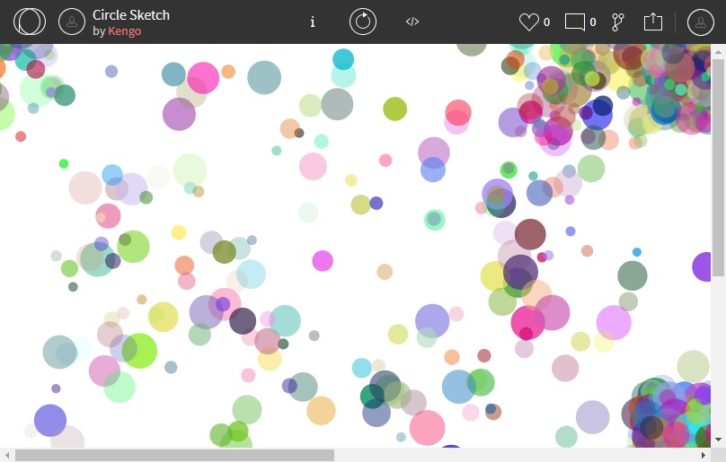

<iframe width="560" height="315" src="https://www.youtube.com/embed/top94bl0Hcc" title="YouTube video player" frameborder="0" allow="accelerometer; autoplay; clipboard-write; encrypted-media; gyroscope; picture-in-picture" allowfullscreen></iframe>

# About
しがない新人PGです。

## Profile
- 八木下賢悟(やぎしたけんご)
- 愛知県名古屋市
- HTML/CSS/JavaScript, Java, VB.NET, SQL, ERPシステム

## Skills
- Windows
- HTML/CSS/JavaScript, C, Java, Excel VBA, VB.NET, SQL Server
- Servlet, Node.js, Express, Infor Syteline

## Works
- [GitHub](https://github.com/KengoYagishita)
- OpenProcessing
<iframe src="https://openprocessing.org/sketch/1287807/embed/" width="400" height="400"></iframe>
